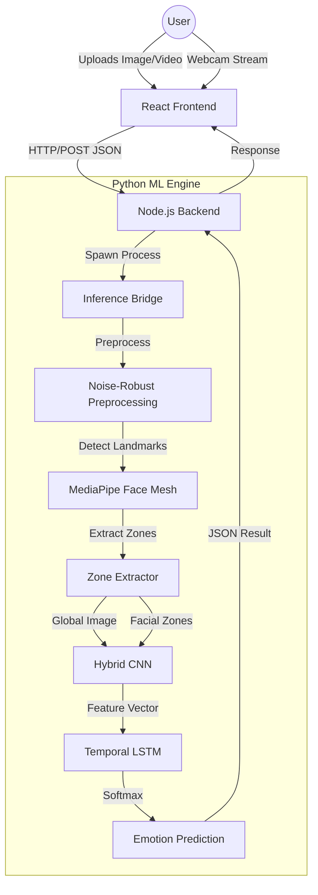

# 🏗️ Aura AI - System Architecture

This document provides a detailed overview of the architectural design, component interaction, and technology stack of the Aura AI Facial Emotion Recognition System.

---

## 1. System Overview
Aura AI follows a decoupled client-server architecture designed for high-performance real-time emotion analysis. The system is divided into three primary layers:
1.  **Frontend (UI Layer)**: A React-based single-page application.
2.  **Backend (API Gateway)**: A Node.js Express server that manages requests and bridges to the ML engine.
3.  **ML Engine (Processing Layer)**: A Python-based deep learning suite for computer vision and emotion classification.

---

## 2. Component Diagram


---

## 3. Technology Stack

| Layer | Technology | Version | Purpose |
| :--- | :--- | :--- | :--- |
| **Frontend** | React | 19.2.0 | UI Framework |
| | Vite | 7.3.1 | Build Tool |
| | Tailwind CSS | 4.1.18 | Styling |
| | Axios | 1.13.5 | HTTP Client |
| | Lucide React | 0.563.0 | Icon Library |
| **Backend** | Node.js | 20.19+ | Runtime |
| | Express | 5.2.1 | Web Server |
| | CORS | 2.8.6 | Cross-Origin Resource Sharing |
| | Body Parser | 2.2.2 | JSON Parsing |
| | Child Process | Built-in | Python Bridge |
| **ML Engine** | Python | 3.8+ | ML Runtime |
| | PyTorch | ≥2.0.0 | Deep Learning Framework |
| | Torchvision | ≥0.15.0 | Vision Utilities |
| | MediaPipe | ≥0.10.0 | Face Detection & Landmarks |
| | OpenCV | ≥4.8.0 | Image Processing |
| | NumPy | ≥1.24.0 | Numerical Computing |
| | Pandas | ≥2.0.0 | Data Manipulation |
| | Albumentations | ≥1.3.0 | Data Augmentation |
| | TensorBoard | ≥2.13.0 | Training Visualization |
| | PyYAML | ≥6.0 | Configuration |

---

## 4. ML Model Architecture

### Hybrid CNN-LSTM
The core of the system is a custom neural network that combines spatial and temporal feature extraction:

1.  **Zone-Based CNN**: Instead of analyzing the whole face as a single block, the model extracts 5 key facial zones (Eyes, Eyebrows, Nose, Mouth, and Forehead). Each zone is processed by a specialized sub-network.
2.  **Global Feature Extractor**: A parallel branch processes the entire face to capture overall facial structure and lighting.
3.  **Feature Fusion**: Features from all zones and the global branch are concatenated into a high-dimensional feature vector.
4.  **Temporal LSTM**: For video and webcam streams, an LSTM layer processes a sequence of feature vectors to understand emotion transitions (e.g., the transition from Neutral to Happy).

---

## 5. Data Flow

### Inference Pipeline
1.  **Frame Capture**: The frontend captures a frame (from webcam or video) and converts it to a base64 string.
2.  **API Request**: The frame is sent to `/api/analyze` via POST.
3.  **Python Bridge**: The Node.js server executes `inference_bridge.py` via `child_process.spawn`.
4.  **Preprocessing**: The image is normalized using CLAHE (Contrast Limited Adaptive Histogram Equalization) and filtered for noise.
5.  **Landmark Detection**: MediaPipe identifies 468 facial landmarks.
6.  **Zone Extraction**: The `ZoneExtractor` crops the 5 predefined facial regions.
7.  **Classification**: The model predicts the probability for 7 emotions:
    - Angry, Disgust, Fear, Happy, Sad, Surprise, Neutral.
8.  **Result Aggregation**: The backend receives the Python output and returns a structured JSON response.

---

## 6. Directory Structure

```text
.
├── backend/            # Express server and Python bridge
├── configs/            # System configuration (config.yaml)
├── frontend/           # React frontend (Vite/Tailwind)
├── src/                # Core ML source code
│   ├── inference/      # Inference scripts for different modes
│   ├── models/         # Neural network definitions
│   ├── preprocessing/  # Image cleaning and normalization
│   ├── training/       # Training and evaluation scripts
│   └── zone_extraction/# Facial region segmentation
├── requirements.txt    # Python dependencies
└── ARCHITECTURE.md     # This document
```

---

## 11. Project Resources

- **Main Repository**: [shashank1833/Facial-Emotion-Recognition-Using-Deep-Learning](https://github.com/shashank1833/Facial-Emotion-Recognition-Using-Deep-Learning)
- **Technical Lead**: Shashank Reddy Remidi
- **Email**: shashankreddyremidi@gmail.com
