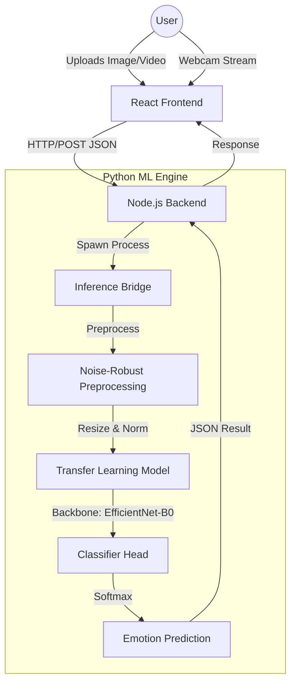

# 🏗️ Aura AI - System Architecture

This document provides a detailed overview of the architectural design, component interaction, and technology stack of the Aura AI Facial Emotion Recognition System.

---

## 1. System Overview
Aura AI follows a decoupled client-server architecture designed for high-performance real-time emotion analysis. The system is divided into three primary layers:
1.  **Frontend (UI Layer)**: A React-based single-page application.
2.  **Backend (API Gateway)**: A Node.js Express server that manages requests and bridges to the ML engine.
3.  **ML Engine (Processing Layer)**: A Python-based deep learning suite for computer vision and emotion classification using Transfer Learning.

---

## 2. Component Diagram


---

## 3. Technology Stack

| Layer | Technology | Version | Purpose |
| :--- | :--- | :--- | :--- |
| **Frontend** | React | 19.2.0 | UI Framework |
| | Vite | 7.3.1 | Build Tool |
| | Tailwind CSS | 4.1.18 | Styling |
| | Axios | 1.13.5 | HTTP Client |
| | Lucide React | 0.563.0 | Icon Library |
| **Backend** | Node.js | 20.19+ | Runtime |
| | Express | 5.2.1 | Web Server |
| | CORS | 2.8.6 | Cross-Origin Resource Sharing |
| | Body Parser | 2.2.2 | JSON Parsing |
| | Child Process | Built-in | Python Bridge |
| **ML Engine** | Python | 3.8+ | ML Runtime |
| | PyTorch | ≥2.0.0 | Deep Learning Framework |
| | Torchvision | ≥0.15.0 | Vision Utilities |
| | OpenCV | ≥4.8.0 | Image Processing |
| | NumPy | ≥1.24.0 | Numerical Computing |
| | Albumentations | ≥1.3.0 | Data Augmentation |
| | TensorBoard | ≥2.13.0 | Training Visualization |
| | PyYAML | ≥6.0 | Configuration |

---

## 4. ML Model Architecture

### Image-Based Transfer Learning
The system uses a modern transfer learning approach optimized for accuracy and inference speed:

1.  **Backbone**: **EfficientNet-B0** (pre-trained on ImageNet). It captures rich spatial features and textures far more effectively than custom shallow CNNs.
2.  **Global Feature Extraction**: Instead of manual zone cropping, the model leverages the global receptive field of the backbone to understand facial geometry.
3.  **Classifier Head**: A custom head with Global Average Pooling, Dropout (0.4), and a dense layer mapping to 7 emotion classes.
4.  **Optimization**: Trained using **Focal Loss** to handle class imbalance (e.g., Disgust vs Happy) and the **AdamW** optimizer with **Cosine Annealing** for robust convergence.

---

## 5. Data Flow

### Inference Pipeline
1.  **Frame Capture**: The frontend captures a frame and converts it to a base64 string.
2.  **API Request**: The frame is sent to `/api/analyze` via POST.
3.  **Python Bridge**: The Node.js server executes the inference script via `child_process.spawn`.
4.  **Preprocessing**: The image is normalized using CLAHE (Contrast Limited Adaptive Histogram Equalization) and resized to 224x224.
5.  **Classification**: The model predicts the probability for 7 emotions:
    - Angry, Disgust, Fear, Happy, Sad, Surprise, Neutral.
6.  **Temporal Smoothing**: Real-time predictions are smoothed using a moving average window to prevent flickering.
7.  **Result Aggregation**: The backend returns a structured JSON response.

---

## 6. Directory Structure

```text
.
├── backend/            # Express server and Python bridge
├── configs/            # System configuration (config.yaml)
├── frontend/           # React frontend (Vite/Tailwind)
├── src/                # Core ML source code
│   ├── inference/      # Image-based inference scripts
│   ├── models/         # EfficientNet/MobileNet definitions
│   ├── preprocessing/  # Image cleaning and normalization
│   ├── training/       # Training, evaluation, and losses
│   └── utils/          # Metrics and helper functions
├── requirements.txt    # Python dependencies
└── ARCHITECTURE.md     # This document
```

---

## 7. Project Resources

- **Main Repository**: [shashank1833/Facial-Emotion-Recognition-Using-Deep-Learning](https://github.com/shashank1833/Facial-Emotion-Recognition-Using-Deep-Learning)
- **Technical Lead**: Shashank Reddy Remidi
- **Email**: shashankreddyremidi@gmail.com
